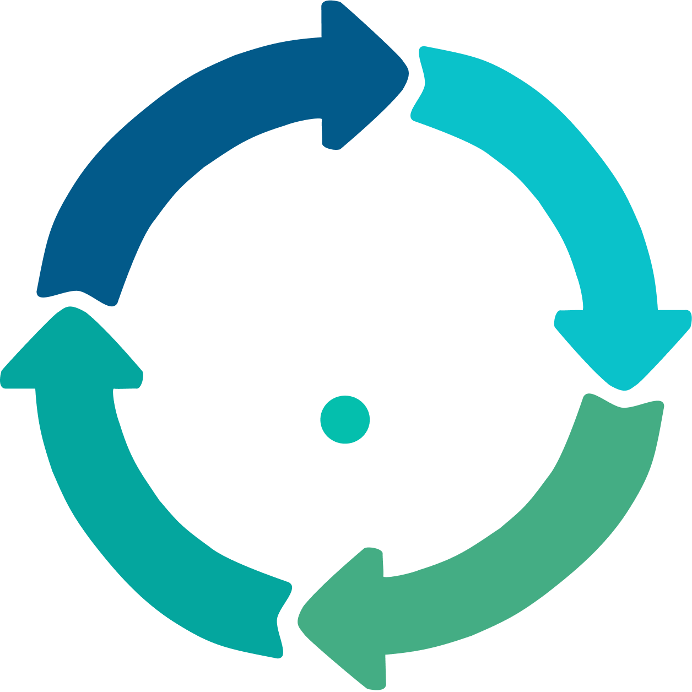

    

<h2 align="center">Bem-vindo(a) ao ACTA!</h2>

    <em>Transformando planejamento em resultado.</em>

---

## Sobre nós

Somos a equipe do **ACTA**, que é dedicada a criar uma ferramenta digital para controle do ciclo do PDCA. Nossa missão é digitalizar o gerenciamento e geração de planos de ação, análise de causas e documentos de padronização, transformando a metodologia do PDCA em um fluxo estruturado, rastreável e potencializado por inteligência artificial.

## Principais funcionalidades

### Coleta de Dados
- Formulários dinâmicos configuráveis pelo gestor
- Importação de dados via .csv/.xlsx
- Registro de data/hora automático
- Anexos (arquivos, fotos, dados)
- Assinatura digital

### Análise
- Diagrama de Ishikawa
- 5 Porquês com encadeamento aberto até a causa raiz
- Priorização de problemas
- Redefinição estruturada do problema

### Execução
- Cronograma / Gráfico de Gant
- Kanban
- Atribuição de responsáveis
- Controle de prazo
- Registro de desvios

### Governança
- Padronização de soluções
- Bloqueio de avanço de etapas
- Aprovação manual do gestor

### Relatórios
- Relatórios one-click
- Dashboard gerencial em tempo real
- Visualização de desempenho por colaborador
- KPIs configuráveis
- Comparação entre ciclos encerrados
- Lições aprendidas

### Inteligência Artificial
- Sugestão de causas e ações
- Geração de documentos de padronização
- Recomendação de padrões baseada em ciclos anteriores
- Detecção de recorrência de problemas

---

## Ferramentas e Tecnologias que Utilizamos

### FRONT-END:

   

### BACK-END:

  

### BANCO DE DADOS:

  

### ANÁLISE DE DADOS

  

### DESIGN (UI/UX):

### DEVOPS:

   

### IDES E EDITORES DE TEXTO:

---

## Nosso time

### Primeiro Ano

<table align="center" border="0" cellpadding="0" cellspacing="0">
    <tr>
        <td valign="top">
            <table>
                <tr>
                    <td valign="top" width="100px">
                        
                    </td>
                    <td valign="top">
                        <strong>Ana Luisa Melo</strong> 
                        <a href="https://github.com/alunoAnaMelo">@alunoAnaMelo</a> 
                        <small>DESIGNER / FRONT-END DEV</small>
                    </td>
                </tr>
                <tr>
                    <td valign="top" width="100px">
                        
                    </td>
                    <td valign="top">
                        <strong>Arthur Amorim</strong> 
                        <a href="https://github.com/Arthur676142">@Arthur676142</a> 
                        <small>BACK-END DEV</small>
                    </td>
                </tr>
                <tr>
                    <td valign="top" width="100px">
                        
                    </td>
                    <td valign="top">
                        <strong>Cauê Minini</strong> 
                        <a href="https://github.com/cAlvarezx">@cAlvarezx</a> 
                        <small>DADOS / BACK-END DEV</small>
                    </td>
                </tr>
            </table>
        </td>
        <td width="50"> </td>
        <td valign="top">
            <table>
                <tr>
                    <td valign="top" width="100px">
                        
                    </td>
                    <td valign="top">
                        <strong>Mariana Xavier</strong> 
                        <a href="https://github.com/marixavierr">@marixavierr</a> 
                        <small>BACK-END DEV</small>
                    </td>
                </tr>
                <tr>
                    <td valign="top" width="100px">
                        
                    </td>
                    <td valign="top">
                        <strong>Rapahel Braga</strong> 
                        <a href="https://github.com/Raphinha301">@Raphinha301</a> 
                        <small>FRONT-END DEV</small>
                    </td>
                </tr>
            </table>
        </td>
    </tr>
</table>

### Segundo Ano

<table align="center" border="0" cellpadding="0" cellspacing="0">
    <tr>
        <td valign="top">
            <table>
                <tr>
                    <td valign="top" width="100px">
                        
                    </td>
                    <td valign="top">
                        <strong>Amanda Andrade</strong> 
                        <a href="https://github.com/amandaandrade9410">@amandaandrade9410</a> 
                        <small>DADOS</small>
                    </td>
                </tr>
                <tr>
                    <td valign="top" width="100px">
                        
                    </td>
                    <td valign="top">
                        <strong>Cibelle Goltara</strong> 
                        <a href="https://github.com/cibellegoltara">@cibellegoltara</a> 
                        <small>DESIGNER / FRONT-END DEV</small>
                    </td>
                </tr>
                <tr>
                    <td valign="top" width="100px">
                        
                    </td>
                    <td valign="top">
                        <strong>Davi Aliaga</strong> 
                        <a href="https://github.com/kv-aliaga">@kv-aliaga</a> 
                        <small>BACK-END DEV</small>
                    </td>
                </tr>
            </table>
        </td>
        <td width="50"> </td>
        <td valign="top">
            <table>
                <tr>
                    <td valign="top" width="100px">
                        
                    </td>
                    <td valign="top">
                        <strong>Gabriel Bordin</strong> 
                        <a href="https://github.com/gabriel-c-bordin">@gabriel-c-bordin</a> 
                        <small>DADOS / FRONT-END DEV</small>
                    </td>
                </tr>
                <tr>
                    <td valign="top" width="100px">
                        
                    </td>
                    <td valign="top">
                        <strong>Gabriel Vigna</strong> 
                        <a href="https://github.com/bielvigna">@bielvigna</a> 
                        <small>DADOS</small>
                    </td>
                </tr>                
                <tr>
                    <td valign="top" width="100px">
                        
                    </td>
                    <td valign="top">
                        <strong>Lucas Almeida</strong> 
                        <a href="https://github.com/lucasAlmeida2212">@lucasAlmeida2212</a> 
                        <small>BACK-END DEV</small>
                    </td>
                </tr>
            </table>
        </td>
    </tr>
</table>
